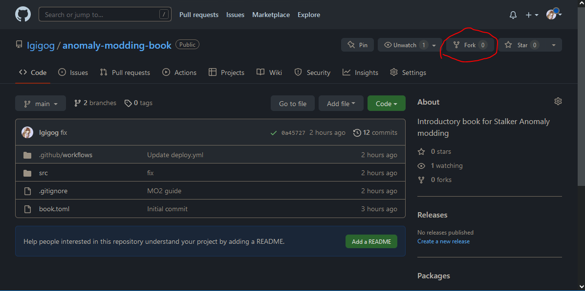
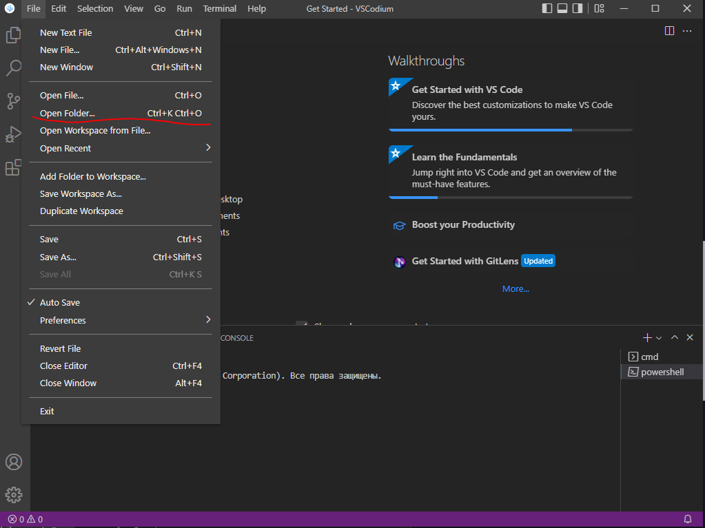
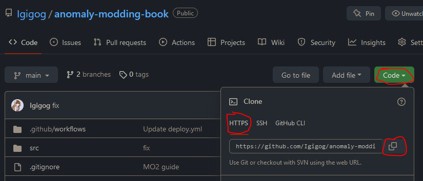
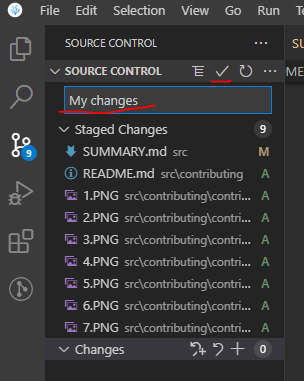
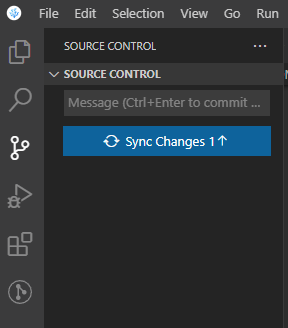
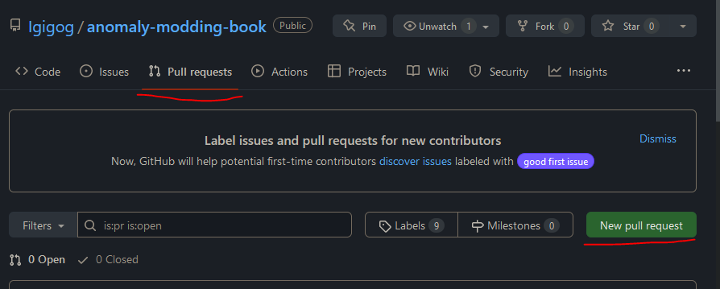

# Contributing to this book

___

## First way to contribute

You can easily suggest edits by clicking on the button at the top right


___

## Second way to contribute

This book is written using [mdBook](https://github.com/rust-lang/mdBook). To contribute to this book, you will need:

1. [mdBook](https://github.com/rust-lang/mdBook)
2. [git](https://gitforwindows.org/)
3. [GitHub](https://github.com/) account
4. (Optional) [VSCodium](https://vscodium.com/)

VSCodium or VSCode is highly recommended to use. Although it is optional, I will assume you are using it.

Below I describe the setup steps needed to run and contribute to this book. *__But before that, go and install VSCodium and Git__*.

## Forking book repository

Contributing to this book follows the standart "Pull Request" workflow. That basically means that you will have your own copy of the book, and you will ask us to pull your changes into the main repository.

Here is the overview of steps needed for contributing:

1. Copy ("fork") the main repository
2. Download your copy of repo
3. Add your changes to your copy
4. Upload your changes
5. Open the Pull Request to merge your changes into main repository

Welp, let's get started. I hope you already have a GitHub account.

### Forking

1. Go to the [main repo](https://github.com/Igigog/anomaly-modding-book)
2. Press the fork button

    

3. Create the fork

    

4. You're awesome

#### Downloading your repo

1. Open the folder you want to download into in VSCodium. In my case, it will be Desktop.

    

2. Open Poweshell Terminal session
3. Copy the link to your repo.

    

4. Run the following command in your Powershell Terminal with your link instead of LINK.

    ```git
    git clone LINK
    ```

5. You're awesome.

#### Running local copy

1. Download latest mdbook from [Github Releases](https://github.com/rust-lang/mdBook/releases).
2. Drop `mdbook.exe` in the root folder of your copy.
3. Run `run.bat`. In case it doesn't open by itself, open [localhost:3000](localhost:3000) in your browser.
4. Done. You're awesome.

#### Uploading your changes

1. Set your git up. Here's a great [guide](https://docs.github.com/en/get-started/quickstart/set-up-git)

2. Add your changes using VSCodium git tab. Open git tab, hover over "Changes" line and press "+".

    

3. Add a nice message and press "✔" to commit your changes

    

4. You should now be able to publish your changes

    

## Creating Pull Request

1. In main book repository, open "Pull Requests" tab and press "New pull request"

    

2. Press "compare across forks". Choose your repository and press "Create pull request".

3. You're awesome. Probably. Now ping Igigog#6387 in Discord to get your pull request reviewed.

4. Done. Your changes are added to the main book.

___

### P.S

If you will be using VSCodium or VSCode, it is recommended to install markdown extensions to make life easier or to avoid messing up the book structure.

For example such as:

- [Markdown Link Updater](https://open-vsx.org/extension/mathiassoeholm/markdown-link-updater) - Updates Markdown links automatically, when files in the workspace are moved or renamed.
- [markdownlint](https://open-vsx.org/extension/DavidAnson/vscode-markdownlint) - This is a rule library for encouraging standards and consistency for Markdown files.
