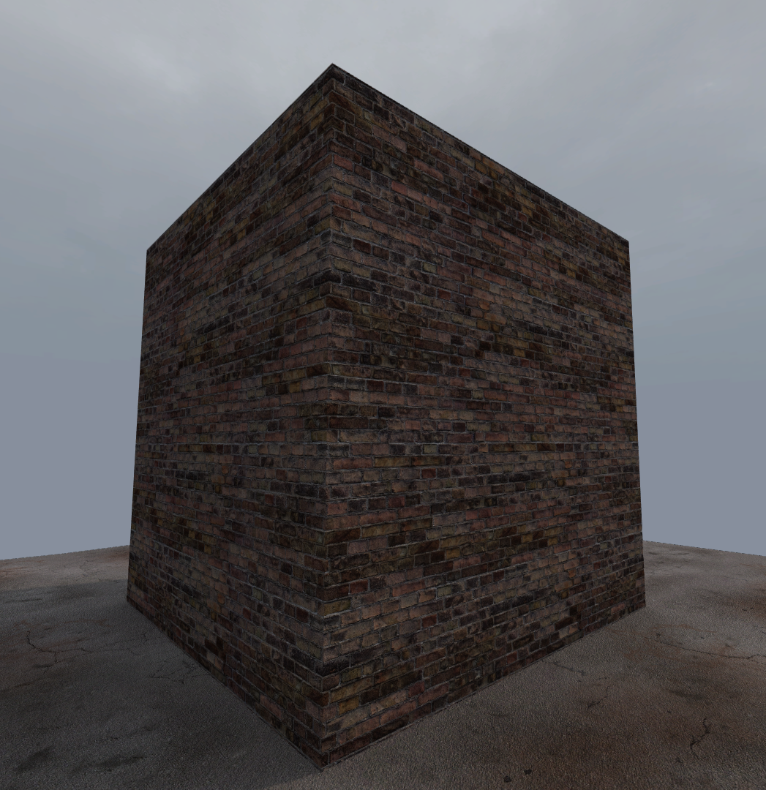

# Terminology

___

## Engine

### ODE

ODE (Open Dynamics Engine) - is an open physics engine distributed for free as a dynamically linked library. Its main components are an Absolute-Solid Dynamics system and a collision detection system.

[Source Code](https://bitbucket.org/odedevs/ode/src/master/)

### A-Life

A-Life (Artificial Life) - artificial intelligence system.

### OpenAL

OpenAL (Open Audio Library) - cross-platform application programming interface (API) for working with audio data. A key feature is working with sound in 3D space and using EAX effects.

___

## Models

## Dynamic object

Any movable object (which can be displaced from its place regardless of the scripts)

Example:

Distinguishing features:

- Has a bone collision

## Static object

Any static object at the level

Example (in this case, part of the collision level):

Distinguishing features:

- Does not have a bone collision

### *object*_hud

HUD (Head-Up Display) - is a set of graphical interfaces and decorative elements located in the foreground and/or in the game world, which are designed to clearly and quickly convey to the player the necessary information from the game at a given point in time, without interfering with the gameplay experience.

In stalker modding, *object*_hud is a model in front of the player in the hands of the character. Usually it is a model of a weapon, grenades, etc.

Example:

Distinguishing features:

- Does not have a bone collision

### *object*_world

Model, in-game world (NPC weapons, 3rd-person view). The difference from the _hud model is that the _world must have a collision to calculate the interaction with the game.

Example:

Distinguishing features:

- Has a bone collision
- Dynamic object

___

## Animations

### *object*_hud animations

Animations for the _hud object
