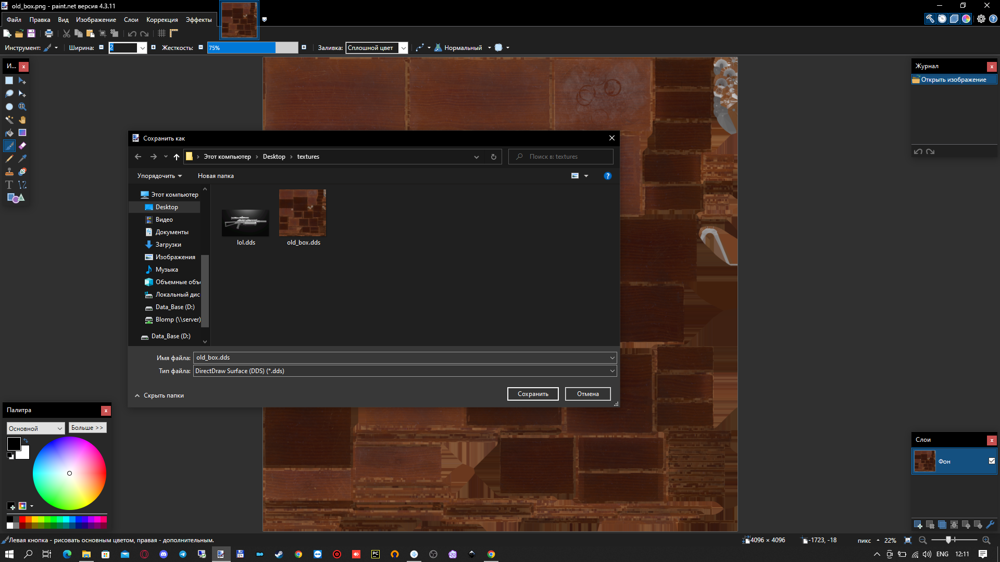
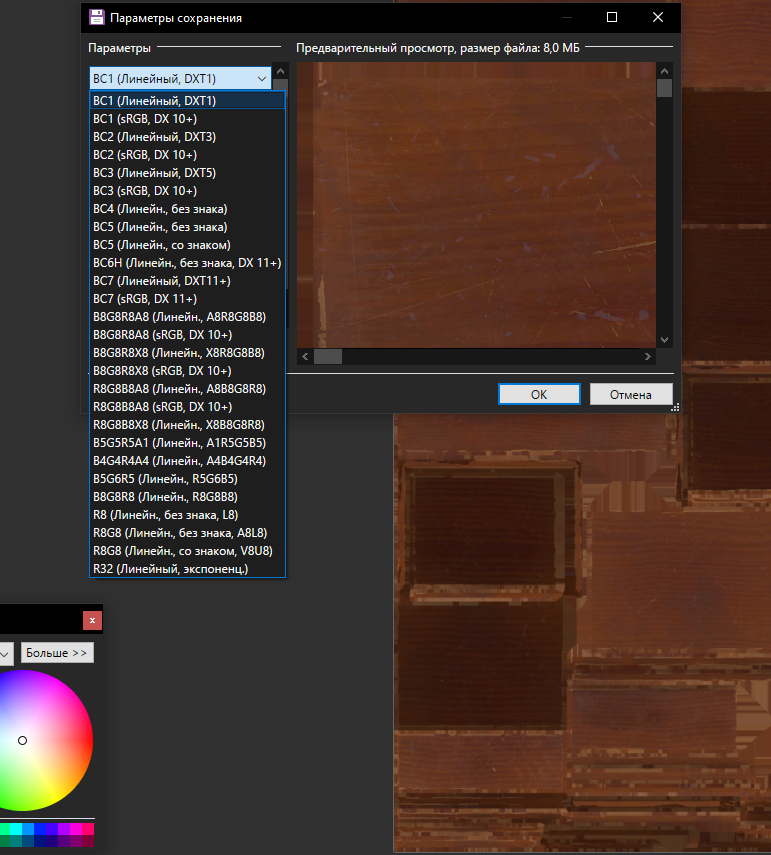

# Creating and preparing textures

___

## Beginning

First, familiarize yourself with the supported texture compression ([.dds](../main-folders-and-files/file-formats/dds.md) [.bump](../main-folders-and-files/file-formats/bump.md) [.bump#](../main-folders-and-files/file-formats/bump_hash.md))

## Start

First we have to create a texture, or we have to download one.
Next, we need to convert our texture into [.dds](../main-folders-and-files/file-formats/dds.md) format.
To do this, you can use any program of yours that can do such a thing. (or you can take a program from [this](../modding-tools/modding-tools.md) list)

The most commonly used program for this is Paint.net. We download the texture and save it as [.dds](../main-folders-and-files/file-formats/dds.md). 
The Save Settings window appears.

We have to choose the texture compression that suits us.

Save our texture.
All of this may come in handy, for example for [creating a model](../blender/creating-model-in-blender.md).